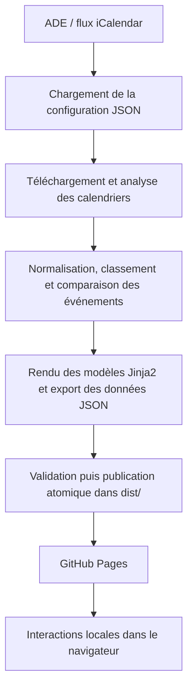

# RTGRE

Site étudiant qui regroupe l'emploi du temps, les évaluations, les modules, un calcul de notes indicatif, une liste personnelle et un suivi des absences pour la troisième année du BUT Réseaux et Télécommunications de l'IUT1 de Grenoble.

Site en ligne : https://rtgre.fr

Projet étudiant non officiel. Il ne remplace pas ADE ni les informations communiquées par l'IUT. En cas de doute, ADE reste la référence.

## Sommaire

- [Pourquoi ce projet](#pourquoi-ce-projet)
- [Fonctionnalités](#fonctionnalités)
- [Architecture](#architecture)
- [Organisation du dépôt](#organisation-du-dépôt)
- [Technologies](#technologies)
- [Installation locale](#installation-locale)
- [Configuration](#configuration)
- [Tests et qualité](#tests-et-qualité)
- [Déploiement](#déploiement)
- [Données personnelles et limites](#données-personnelles-et-limites)
- [Licence](#licence)

## Pourquoi ce projet

Pendant la formation, les informations utiles sont réparties entre plusieurs services : ADE pour l'emploi du temps, Chamilo pour les espaces des modules, la messagerie universitaire, le GitLab universitaire, et les informations sur les modules, les coefficients et les évaluations.

Cette répartition rend le suivi quotidien peu pratique. ADE permet de consulter un planning, mais il est difficile d'y rechercher un cours, de filtrer les évaluations, de comparer plusieurs groupes ou de retrouver rapidement une information précise.

Ce projet rassemble ces usages sur un site unique, plus simple à consulter, adapté au contenu de cette formation. Le contenu actuel couvre les parcours Cybersécurité et DevCloud, la formation initiale et l'alternance, six groupes et les semestres 5 et 6 pour l'année configurée. Le code est paramétrable, mais il n'est pas pensé comme une plateforme générique pour d'autres établissements.

## Fonctionnalités

### Emploi du temps

Le calendrier est construit à partir des flux iCalendar d'ADE. Il propose une vue par jour, par semaine et une vue annuelle, ainsi que la navigation par date. La recherche porte sur le cours, le module, la salle, l'enseignant ou le groupe.

Il permet aussi de filtrer les évaluations, de masquer les cours sans enseignant, de comparer l'emploi du temps avec un autre groupe et d'afficher les cours communs ou les différences. Le cours en cours et l'heure actuelle sont indiqués. Les réglages de consultation sont conservés temporairement dans la session du navigateur.

### Évaluations

Le générateur repère certaines évaluations à partir de leur titre dans ADE. Les règles de reconnaissance sont définies dans `config/categories.json` et couvrent actuellement : DS surveillé, partiel machine, partiel, soutenance, oral noté, revue et une catégorie « surveillé par la scolarité ».

Les évaluations sont affichées par mois et peuvent être filtrées par catégorie, module et période, ou recherchées. Une page de détail permet de comparer une même évaluation entre les groupes, de repérer les différences de date, d'horaire, de salle ou d'enseignant, et de retrouver une date proche dans un autre groupe lorsque l'évaluation n'a pas lieu le même jour.

Cette détection dépend des règles de configuration et des informations présentes dans ADE. Elle n'est pas infaillible : un titre inhabituel ou une donnée manquante peut fausser le résultat.

### Modules et ressources

La page des modules regroupe les enseignements par semestre, type de module, parcours et statut de la classe. Elle construit les liens vers les espaces Chamilo correspondants lorsqu'ils sont disponibles. La navigation propose aussi des liens vers la messagerie étudiante et le GitLab universitaire.

### Calcul des notes

Le site propose une saisie locale des notes. Les calculs s'appuient sur les coefficients décrits dans `config/curriculum.json` pour produire les moyennes par UE, par semestre, les synthèses annuelles et la moyenne annuelle globale. Les valeurs saisies sont enregistrées dans le stockage local du navigateur et peuvent être exportées ou importées au format JSON.

Ces résultats ne sont pas des notes officielles. Ce sont des estimations basées sur les coefficients configurés et sur les valeurs saisies par l'utilisateur.

### Liste « À faire »

Chaque classe dispose d'une liste personnelle pour ajouter des notes ou des rappels. Les éléments restent dans le navigateur, sont séparés par classe et par année, peuvent être exportés et importés en JSON, et ne sont envoyés à aucun serveur.

### Suivi des absences

Cette fonction est proposée pour les classes en formation initiale. Elle permet de déclarer une absence sur une journée, une demi-journée, un cours précis ou une période de plusieurs jours. Le site retrouve les cours concernés à partir du planning de la classe.

Elle permet aussi de suivre les absences enregistrées, de distinguer les absences justifiées, non justifiées ou à vérifier, de suivre la remise d'un justificatif, et d'importer ou exporter l'historique en JSON. Une fiche d'absence peut être préparée et générée localement en PDF, avec une annexe ajoutée lorsque le contenu le nécessite. La génération du PDF utilise pdf-lib, fontkit et les polices DejaVu Sans distribuées avec le projet.

### Interface

L'interface est responsive et prévue pour les écrans mobiles. Elle utilise un thème sombre ; l'impression utilise un rendu clair. La navigation reste utilisable au clavier, et les pages principalement informatives fonctionnent partiellement sans JavaScript. Les libellés et contrôles sont pensés pour l'accessibilité, sans que le projet revendique une conformité complète à une norme faute d'audit dédié.

## Architecture

Le projet est un générateur de site statique. Il n'y a pas de serveur applicatif : la génération produit des fichiers HTML, CSS, JavaScript et JSON, puis tout le reste se passe dans le navigateur.



### Génération, en Python

Le pipeline se trouve dans `src/schedule/` :

- `build.py` orchestre la construction complète.
- `config.py` charge et valide les fichiers JSON.
- `fetcher.py` télécharge les calendriers ADE, avec un délai entre les requêtes, plusieurs tentatives et une validation minimale du contenu.
- `parser.py` analyse les documents iCalendar, normalise les dates, salles, enseignants et groupes, et produit les événements internes.
- `classifier.py` applique les règles de détection des évaluations.
- `matcher.py` rapproche les évaluations entre les groupes.
- `curriculum.py` prépare les modules, coefficients, ressources et données de notes.
- `viewmodels.py` prépare les données destinées aux vues.
- `renderer.py` génère les pages avec Jinja2.
- `exporter.py` produit les fichiers JSON utilisés par le calendrier côté navigateur.
- `sitecheck.py` vérifie les liens, les ressources, les fragments et les identifiants HTML du site généré.

La publication est protégée par plusieurs garde-fous : un verrou contre deux générations simultanées, une génération dans un dossier temporaire, une validation avant publication, un remplacement atomique de l'ancienne version, une restauration de la version précédente en cas d'échec et le refus d'écraser certains dossiers non gérés. Ces mesures limitent les mauvaises surprises lors des publications, sans constituer une garantie absolue.

### Navigateur, en JavaScript

Le dossier `static/js/` contient la logique exécutée dans le navigateur : le calendrier et la comparaison des groupes, les filtres des évaluations, le calcul des notes, la liste de tâches, le suivi des absences, la génération du PDF, l'import et l'export JSON, ainsi qu'un accès protégé aux données modifiables entre plusieurs onglets.

Le calendrier de la classe courante est intégré dans la page générée. Les données des autres classes sont chargées à la demande depuis `dist/data/<classe>.json` lors d'une comparaison. Les notes, tâches et absences utilisent `localStorage` ; les filtres et réglages temporaires utilisent selon la page `sessionStorage` ou l'URL.

Il n'y a pas de serveur applicatif, pas d'API privée, pas de base de données, pas de système de compte ni d'authentification. Les notes, tâches et absences ne sont pas envoyées vers un serveur.

## Organisation du dépôt

```
.
├── .github/workflows/   # intégration continue et déploiement GitHub Pages
├── config/              # données de l'année, classes, modules et règles
├── src/schedule/        # générateur Python
├── templates/           # modèles HTML Jinja2
├── static/
│   ├── css/             # styles
│   ├── js/              # logique exécutée dans le navigateur
│   ├── fonts/           # polices utilisées dans les PDF
│   ├── icons/           # icônes Octicons
│   └── vendor/          # bibliothèques PDF distribuées localement
├── tests/
│   ├── python/
│   ├── javascript/
│   └── browser/
├── requirements.txt
├── requirements-dev.txt
├── package.json
└── pyproject.toml
```

Le dossier `dist/` est généré par la construction et n'est pas suivi par Git.

## Technologies

- Python 3.12
- requests, icalendar, Jinja2
- HTML, CSS, JavaScript sans framework côté navigateur
- pdf-lib et @pdf-lib/fontkit pour la génération des PDF
- Node.js 22 pour les outils et les tests JavaScript
- unittest et node:test pour les tests
- Ruff et Prettier pour le formatage et les contrôles
- GitHub Actions et GitHub Pages

Node.js ne fait pas fonctionner le site en production. Il sert aux dépendances, aux contrôles et aux tests.

## Installation locale

Prérequis :

- Python 3.12
- Node.js 22 et npm
- un accès réseau à ADE pour une génération réelle

Toutes les commandes se lancent depuis la racine du dépôt.

```bash
git clone https://github.com/kzsxwsjuldvcbsqt/rtgre.git
cd rtgre

python3.12 -m venv .venv
source .venv/bin/activate

python -m pip install --upgrade pip
python -m pip install -r requirements.txt -r requirements-dev.txt

npm ci
```

Construction du site :

```bash
PYTHONPATH=src python -m schedule.build
```

Le résultat est placé dans `dist/`. Cette commande contacte ADE : elle peut échouer si le service est inaccessible ou si la configuration n'est plus valable.

Prévisualisation locale :

```bash
python -m http.server 8000 --directory dist
```

Puis ouvrir http://localhost:8000

Les tests navigateur complets, utilisés en intégration continue, demandent des outils supplémentaires : Chrome ou Chromium, Firefox pour les vérifications multi-navigateurs, et les outils Poppler `pdfinfo`, `pdftotext` et `pdffonts` pour les contrôles des PDF.

## Configuration

Le comportement et le contenu du site sont décrits dans `config/`.

| Fichier | Rôle |
| --- | --- |
| `config/site.json` | identité du site, année, ADE, Chamilo, formats, enseignants et options générales |
| `config/classes.json` | formations, classes, parcours, statuts et identifiants de ressources ADE |
| `config/categories.json` | règles de reconnaissance des évaluations et marqueurs |
| `config/curriculum.json` | semestres, parcours, modules, UE et coefficients |
| `config/sections.json` | pages internes et liens externes affichés dans la navigation |
| `config/calendar.json` | vues, jours affichés, comparaison et temporisations |
| `config/absences.json` | règles, limites, stockage et mise en page du PDF d'absence |
| `config/tasks.json` | stockage, format d'export et limites de la liste « À faire » |
| `config/labels.json` | textes affichés dans l'interface |

Pour adapter le site à une nouvelle année :

1. mettre à jour l'année et les paramètres ADE dans `config/site.json` ;
2. vérifier les classes et leurs `resource_id` dans `config/classes.json` ;
3. adapter le référentiel des modules et coefficients dans `config/curriculum.json` ;
4. contrôler les règles de classement des évaluations dans `config/categories.json` ;
5. lancer les tests ;
6. reconstruire le site.

## Tests et qualité

Toutes les commandes se lancent depuis la racine du dépôt.

Contrôles Python :

```bash
ruff check src tests
ruff format --check src tests
```

Contrôles JavaScript (formatage, tests unitaires et vérification de syntaxe) :

```bash
npm run check
```

Vérification des ressources PDF :

```bash
sha256sum --check static/PDF-ASSETS.sha256
```

Suite complète, y compris les tests navigateur :

```bash
PYTHONPATH=src python -m unittest discover -s tests -v
```

Les tests couvrent notamment la validation de la configuration, l'analyse et le rapprochement des événements, le rendu du site et ses liens, les calculs de notes, les imports et exports, les limites de stockage, les absences, la génération des PDF, les interactions dans un navigateur, le responsive, le comportement sous préférence système claire ou sombre, ainsi que certains cas d'injection et de données invalides.

## Déploiement

Le déploiement est géré par `.github/workflows/build.yml`. Le workflow s'exécute sur les push vers `main` ou `master`, sur les pull requests, manuellement, et automatiquement toutes les six heures.

Il enchaîne l'installation des dépendances, les contrôles de formatage et de syntaxe, la vérification des ressources PDF, les tests Python, JavaScript et navigateur, l'audit des dépendances, la génération du dossier `dist/`, puis l'envoi de l'artefact GitHub Pages. Le déploiement effectif a lieu sauf pour les pull requests.

Le déclenchement toutes les six heures permet de recopier plusieurs fois par jour les nouvelles données disponibles dans ADE.

## Données personnelles et limites

Les notes, tâches et absences personnelles restent dans le `localStorage` du navigateur. L'application ne les envoie à aucun serveur. Elles sont propres au navigateur et à l'appareil utilisés, et peuvent être perdues si le stockage du navigateur est effacé. Les fonctions d'export JSON permettent de les sauvegarder. Une importation doit provenir d'un fichier de confiance, même si son format est validé. Le site est statique et sans compte utilisateur.

Quelques limites à garder en tête :

- le site est non officiel ; ADE reste la source à vérifier en cas de doute ;
- une modification récente dans ADE peut ne pas apparaître avant le prochain déploiement ;
- la détection des évaluations repose sur des règles et sur la qualité des informations d'ADE ;
- les moyennes sont indicatives et ne remplacent pas les résultats officiels ;
- les balises `noindex` et le fichier `robots.txt` demandent aux moteurs de recherche de ne pas indexer le site, mais ne constituent pas un contrôle d'accès ;
- les emplois du temps et les fichiers JSON générés sont publics dès que le site est déployé sur GitHub Pages.

L'absence d'indexation ne rend donc pas le site privé.

## Licence

Le projet est distribué sous licence MIT. Voir [LICENSE](LICENSE).

Certaines ressources distribuées avec le dépôt conservent leur propre licence :

- Octicons : [static/icons/OCTICONS-LICENSE.md](static/icons/OCTICONS-LICENSE.md)
- DejaVu Sans : [static/fonts/DejaVuSans-LICENSE.txt](static/fonts/DejaVuSans-LICENSE.txt)
- pdf-lib : [static/vendor/pdf-lib-LICENSE.md](static/vendor/pdf-lib-LICENSE.md)
- fontkit : [static/vendor/pdf-lib-fontkit-LICENSE.md](static/vendor/pdf-lib-fontkit-LICENSE.md)
